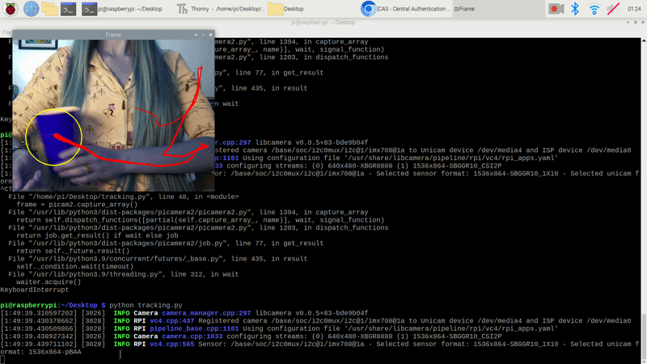

Corresponding solution code for the object tracking lab I developed as a graduate instructor for the ME 456/556: 
Mechatronics course in Fall 2024.  This lab utilizes the OpenCV library to perform object tracking and runs on a 
Raspberry Pi. 

